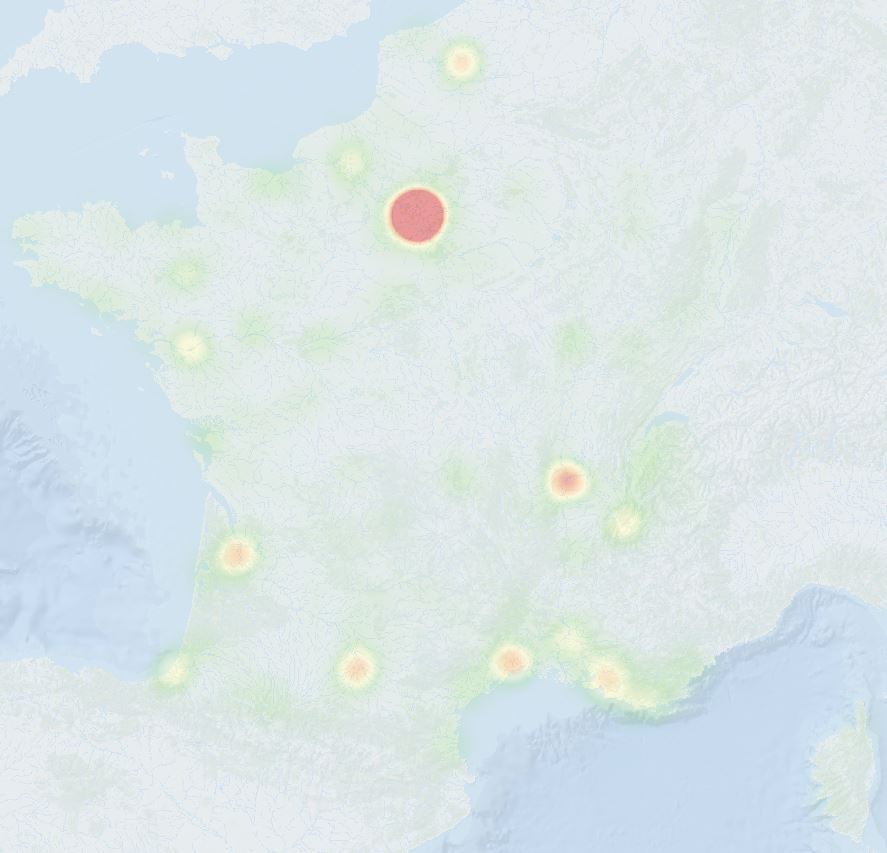
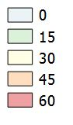

title: Répartition des "Dronistes" en France
sidebarimage: /../../images/MAP_Drone_capture_ecran.jpg
Date: 2016-05-16 10:00
Category: Carto
Tags: Carte, Drone
authors: Hugo Roussaffa
summary: Cartographie des "Dronistes" ayant déposés un manuel d'activitée particulière auprès de la DGAC (novembre 2015)
lang: fr

## Nombre de droniste situé à moins de 40 km

----------

Cette carte est issu d'un traitement réalisé à partir du fichier excel mis à disposition par la DGAC disponible [sur le site du ministère du développement durable](http://www.developpement-durable.gouv.fr).

