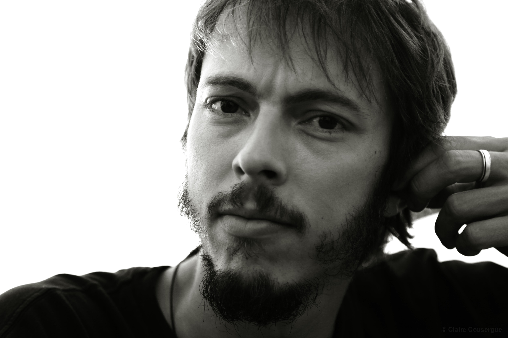

title: Project Manager – GIS Administrator and Spatial Analyst
sidebarimage: /../../images/face_serious.jpg

`yogis`@`alwaysdata`.`net`

----------

Specialities
------------

* Project Management : Agile method specifically Scrum 

* Management and publication of webservice and data cache : WMS,WFS, WMTS, Rest, GeoJson

* GIS administration : software, datastore, datasource and deployment strategy

* GIS integration and architecture design (MVC, N-tiers)

* Data integration and design process automation (Engine Transfert Load)

Favorite Technologies
---------------------

* GIS Desktop : Qgis | ArcGis suite | Mapinfo | Elyx office

* GeoDatabase : PostGIS | Oracle locator | MySQL | ArcSDE

* Framework : ArcPy | GeoDjango | Groovy Grails | ExtJs

* Api : Javascript ESRI | Open Layer | Leaflet | Mapbox | D3

Publications & talks
--------------------

* Roussaffa, H., Zanin C. (dir.), Christophe S. (dir). 2009. Caractérisation de l’harmonie des couleurs dans une carte. Mémoire de M1 de Géographie et Sciences des territoires. Université Paris Diderot Paris 7, 114 p.

* Christophe S., Zanin C., Roussaffa H., 2011, Colours harmony in cartography, 25th International Cartographic Conference (ICC'11), 3-8 July, Paris (France). [read the pdf](http://icaci.org/files/documents/ICC_proceedings/ICC2011/Oral%20Presentations%20PDF/B1-Graphical%20Semiology,%20visual%20variables/CO-084.pdf)

* Protoy L., Roussaffa H., Gueunier S., 2012.  Le SIG provincial (Province Sud / DSI / Service des Applications Métiers). [read the pdf](ftp://ftp.gouv.nc/sig/PUBLIC/matinee/5_SIGprovinceSud_LeaProtoy_HugoRoussaffa_SebastienGueunier.pdf)

Interests
----------

* Geography, Social development and humanitarian mapping

* Statistics and data design

Education
---------

* Level 7 : [Master's degree](http://en.wikipedia.org/wiki/Master%27s_degree#Comparable_European_degrees) in Territorial Science (Human Geography), University of Paris Diderot (Paris VII) University of Paris Sorbone (Paris I) and National School of Geographic Science (ENSG).

* Level 6 - Geography [Licence's degree](http://en.wikipedia.org/wiki/Bachelor%27s_degree#France)

Languages
---------

* Native French

* Basic English and technical in geomatic

Others
------

* Proud member of [CartONG](http://www.cartong.org) 

* Editor member in [OpenStreetMap](http://openstreetmap.org) , like [during  my trip in Vanuatu](https://www.openstreetmap.org/user/goym@p/history#map=7/-18.698/168.673), my name is [goym@p](https://www.openstreetmap.org/user/goym@p)

* YoGis record label followable in [SoundCloud](https://soundcloud.com/yogis-record) 

* See all my experiences in [Viadeo](http://fr.viadeo.com/fr/profile/hugo.roussaffa) 